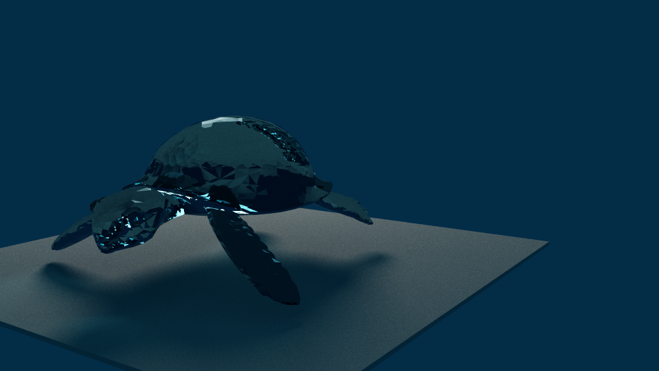

# gtracer
*GPU-accelerated path tracing*

[Development Log](https://paper.dropbox.com/doc/Raytracing--ARAdoX7pwsdC1meXk9FasGKjAQ-3VDT8vLCTEFx3XvIYLlTU)

Austin Atchley, Logan Zartman

<i>Visorman</i>

## Features
* CPU multithreading and CUDA modes
* Intersection testing acceleration using Uniform Grids
* Loading of OBJ-format triangle meshes
* Reflection and refraction

## Dependencies
* SDL2
* GLEW
* Cuda
* Google Test

## Building
* `make`
* `make unit-tests`
* `export SDL_VIDEO_X11_VISUALID=` if you have issues relating to "Couldn't find matching GLX visual"
* `./tracer`

## Use
To view flags, run the binary with no arguments.

Give the tracer an object file as an argument.

After running, you can use the mouse and arrow keys to rotate and translate the camera.

If you specify an output location, the tracer will save a `.bmp` to that path after you exit the program

As the tracer runs, it will report FPS, iterations, and average milliseconds per frame. For each iteration, the tracer averages each image together, and the render becomes more accurate over time. This is due to the randomness of Monte-Carlo path tracing (as opposed to ray tracing).
